# GUI Walkthrough

This walkthrough is the primary guide for material scientists using nanoindentation data in the IndentAnalyzer GUI.

## Before you begin

Prepare:

- a fused-silica reference file (if calibration must be generated),
- an unknown sample file (`.xls`/`.xlsx`),
- target fitting choices (usually Oliver-Pharr first),
- expected physical ranges for your material class.

## Standard workflow overview

The left workflow tabs are:

1. `1. Calibration`
2. `2. Load File`
3. `3. Settings`
4. `4. Results`
5. `5. Export`

Additional tabs: `Expert Mode`, `Log`.

---

## Step 1 — Define calibration strategy (`1. Calibration`)

Decide whether you will load saved area-function coefficients, generate from fused silica, or enter coefficients manually.

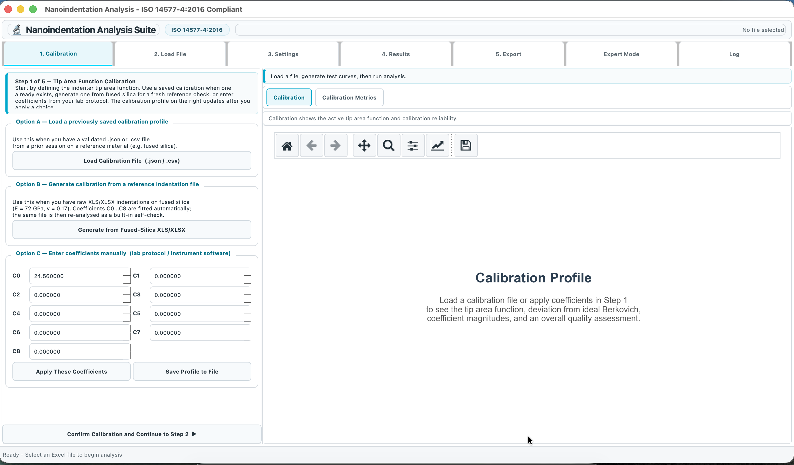{ width="900" }

Scientific intent: a valid area function is required before hardness/modulus from unknown samples can be trusted.

## Step 2 — Generate calibration from fused silica (if needed)

If no approved coefficient set exists, generate a calibration profile from reference data.

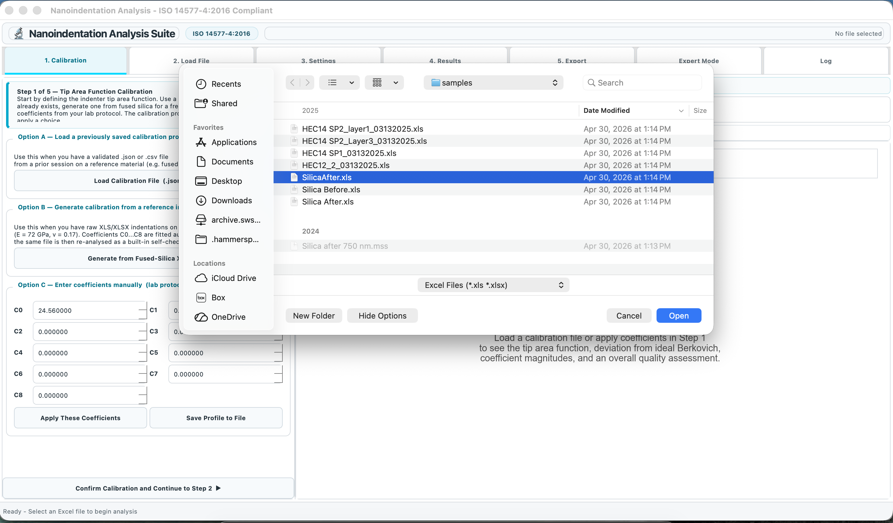{ width="900" }

Reference assumptions commonly used:

\[
E_s = 72\,\text{GPa}, \quad \nu_s = 0.17
\]

## Step 3 — Confirm calibration profile

After generation, review the produced calibration profile before analyzing unknown sample files.

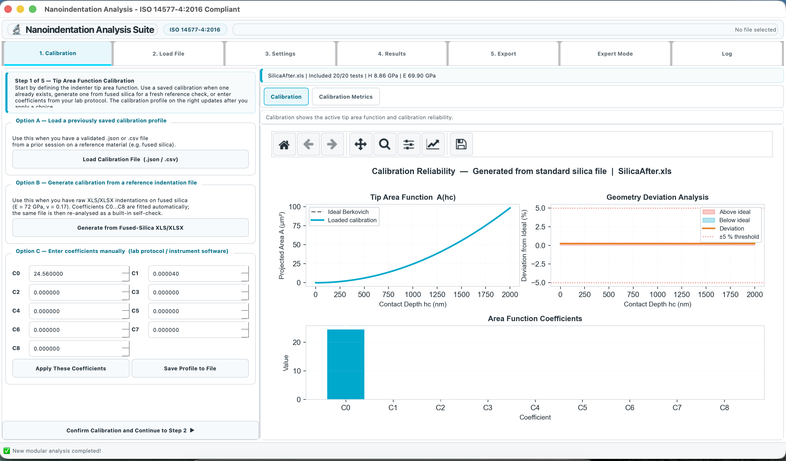{ width="900" }

## Step 4 — Check calibration quality metrics

Use `Calibration Metrics` to confirm fit quality and identify warnings.

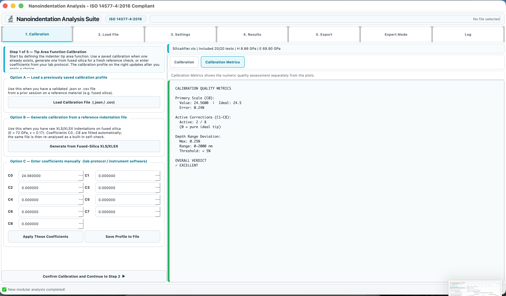{ width="900" }

Do not proceed with poor calibration quality unless you document the limitation.

## Step 5 — Load unknown sample file (`2. Load File`)

Load the experiment file and verify that test sheets are recognized.

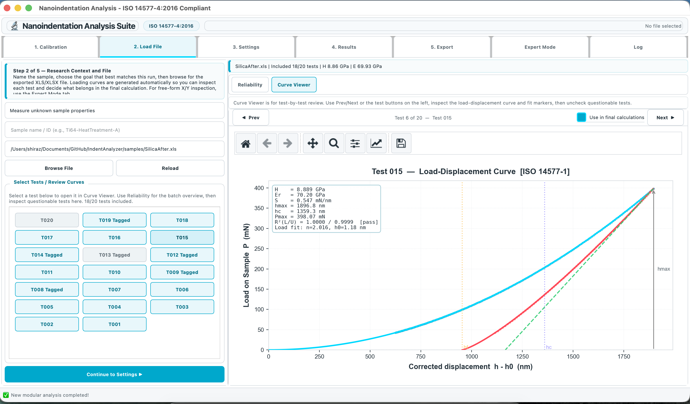{ width="900" }

## Step 6 — Configure analysis settings (`3. Settings`)

Set the fitting model and acceptance thresholds (for example minimum \(R^2\), fitting fraction, sample Poisson ratio).

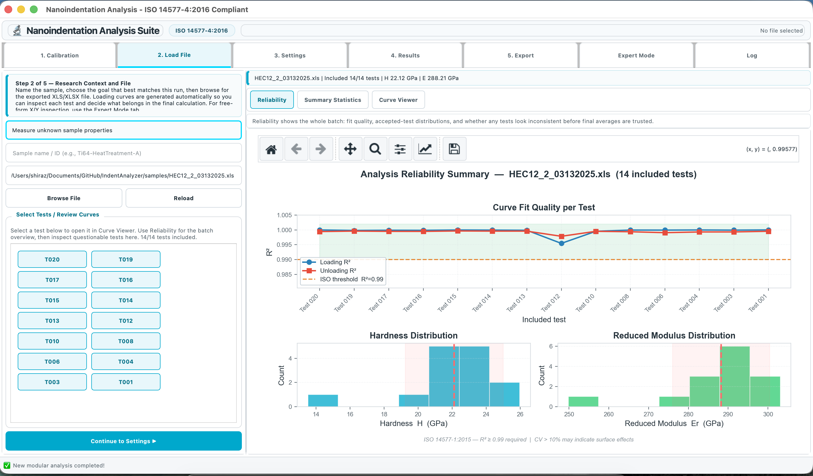{ width="900" }

## Step 7 — Sanity-check curves before run

Inspect representative curves before running full summary statistics.

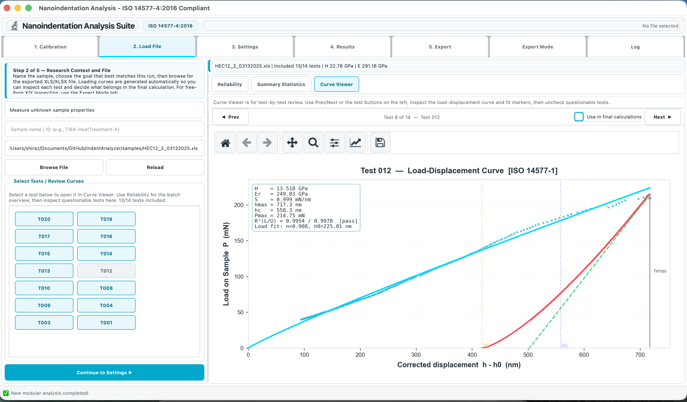{ width="900" }

## Step 8 — Run analysis and review summary (`4. Results`)

Run analysis, then inspect readiness/summary outputs.

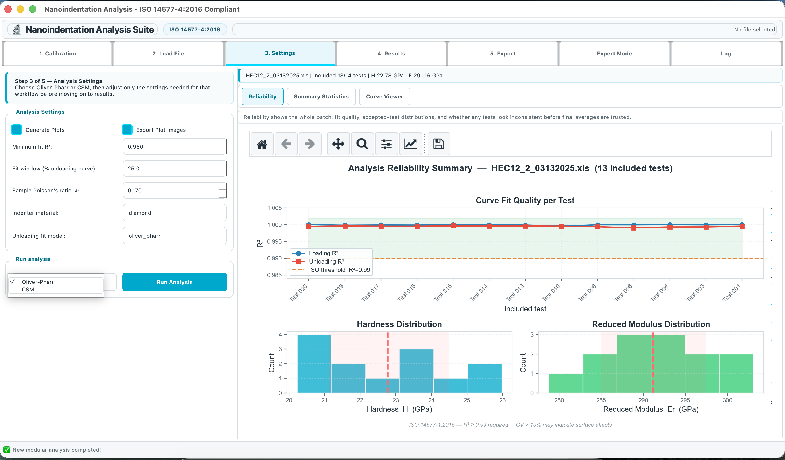{ width="900" }

Useful equations during interpretation:

\[
h_c = h_{\max} - \epsilon\frac{P_{\max}}{S}, \quad \epsilon \approx 0.75
\]

\[
H = \frac{P_{\max}}{A_c}, \qquad E_r = \frac{\sqrt{\pi}}{2\beta}\frac{S}{\sqrt{A_c}}
\]

## Step 9 — Reliability and exclusion decisions

Use `Reliability` and `Curve Viewer` together. Exclude tests only when there is clear scientific justification (artifacts, unstable contact, poor unloading behavior, outlier behavior not explained by structure).

Document exclusion rationale for traceability.

## Step 10 — Export/reporting (`5. Export`)

Export per-test and summary outputs only after final inclusion/exclusion decisions are locked.

Recommended reporting package:

- calibration source and date,
- fitting method and thresholds,
- accepted vs excluded test counts,
- mean ± spread for hardness and modulus,
- representative curves from included and excluded groups.

---

## CSM workflow (when depth profiles are needed)

Use these when analyzing CSM datasets rather than only single-point endpoints.

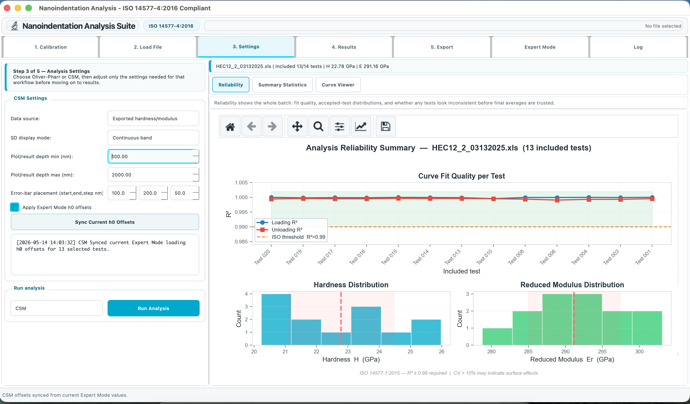{ width="900" }
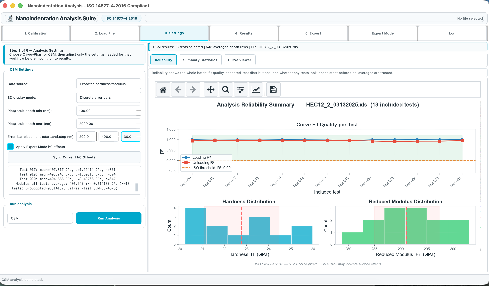{ width="900" }
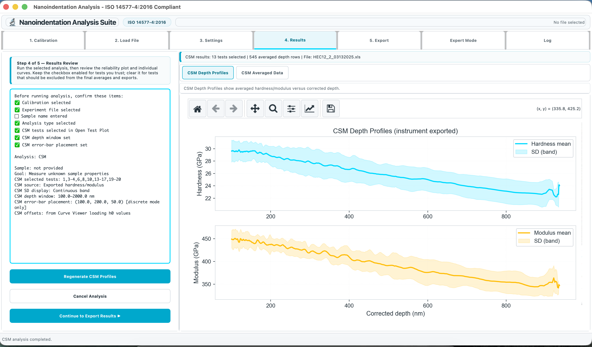{ width="900" }
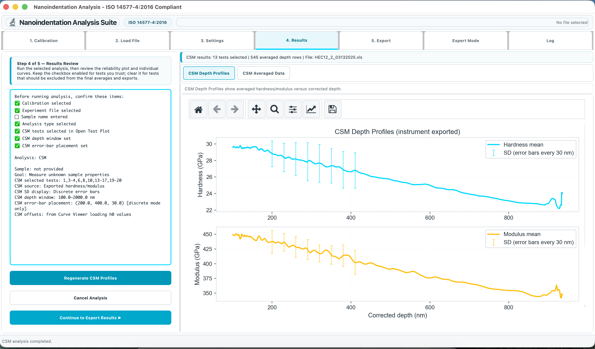{ width="900" }
{ width="900" }
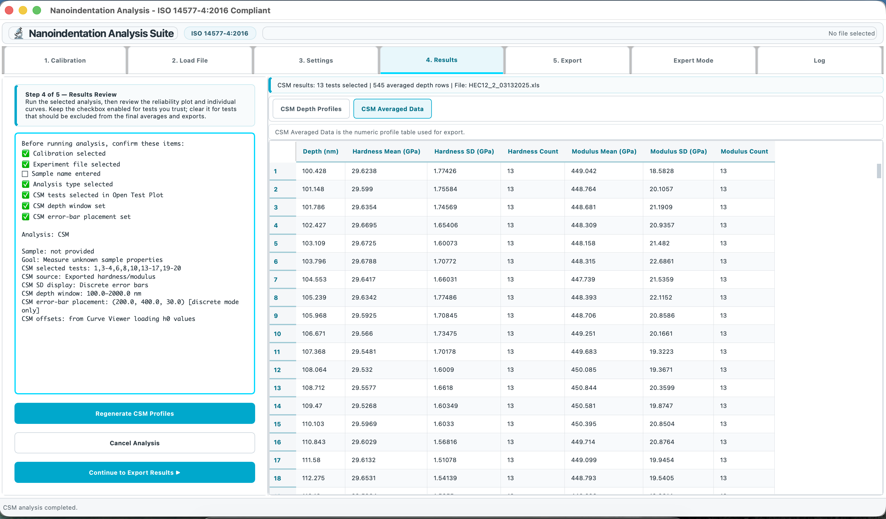{ width="900" }
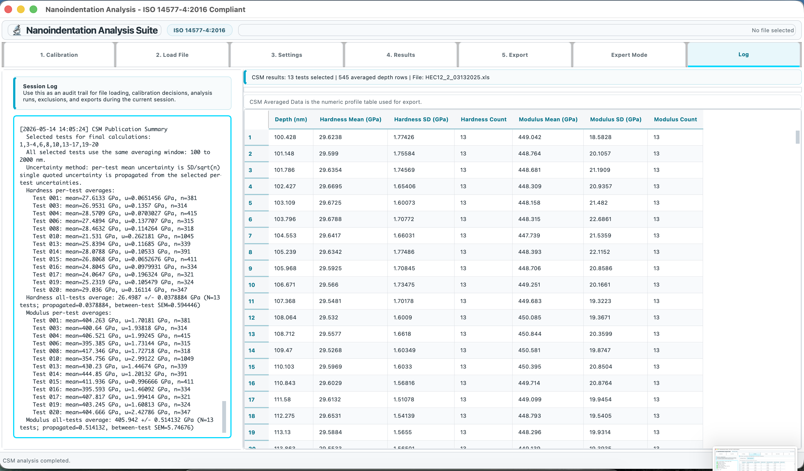{ width="900" }

## Expert Mode (advanced diagnostics)

Use Expert Mode for custom plotting and deeper diagnostics, not as a replacement for the standard 5-step QA workflow.

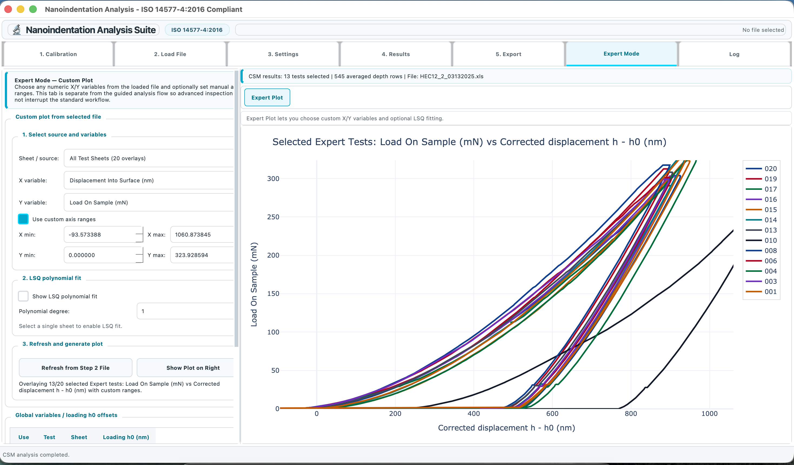{ width="900" }
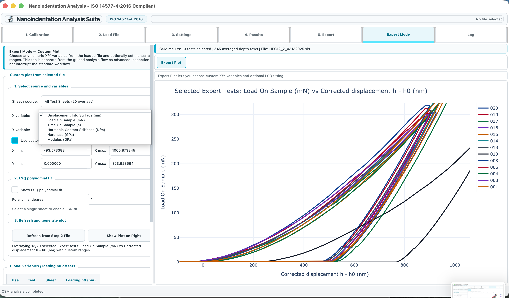{ width="900" }
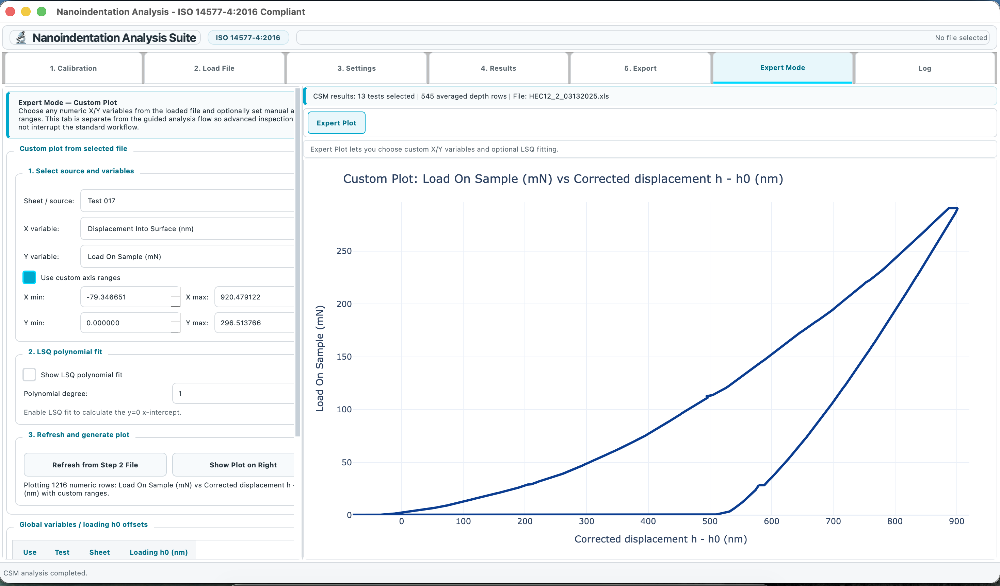{ width="900" }
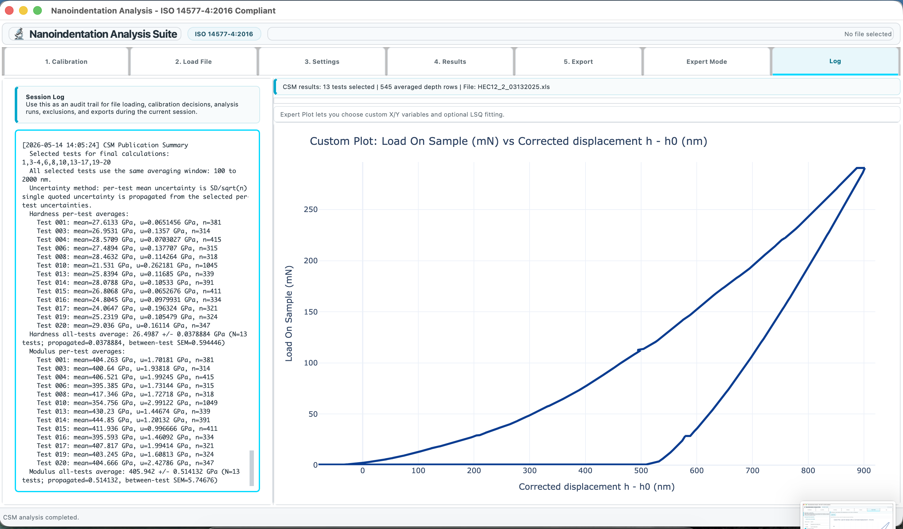{ width="900" }

## Related pages

- [Mathematical Calculations](calculations.md)
- [Analysis Configuration](analysis-configuration.md)
- [Features](features.md)

