# Full workflow

This page expands the current screenshot-based workflow into a guided sequence that matches the active GUI behavior.

## Workflow structure

The application uses five primary steps:

1. **Calibration** — load or generate the tip-area calibration.
2. **Load File** — select the unknown sample file.
3. **Settings** — choose fitting and material parameters.
4. **Results** — run analysis and inspect values.
5. **Export** — save final results.

The results panel provides separate views for calibration output, the results table, reliability summaries, individual test plots, and the analysis log.

## Step 1 — Open the Calibration tab

Calibration converts contact depth into projected contact area for downstream hardness and modulus calculations.

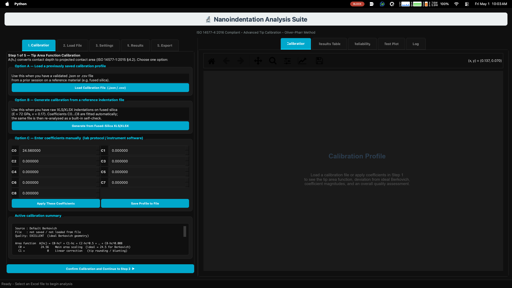

Available calibration paths:

- load an existing calibration profile,
- generate calibration from fused silica,
- manually enter tip-area coefficients.

The projected contact area is represented as:

$$
A(h_c)=C_0h_c^2+C_1h_c+C_2h_c^{1/2}+C_3h_c^{1/4}+C_4h_c^{1/8}+\cdots
$$

For an ideal Berkovich tip:

$$
C_0 = 24.56
$$

## Step 2 — Select the fused-silica calibration file

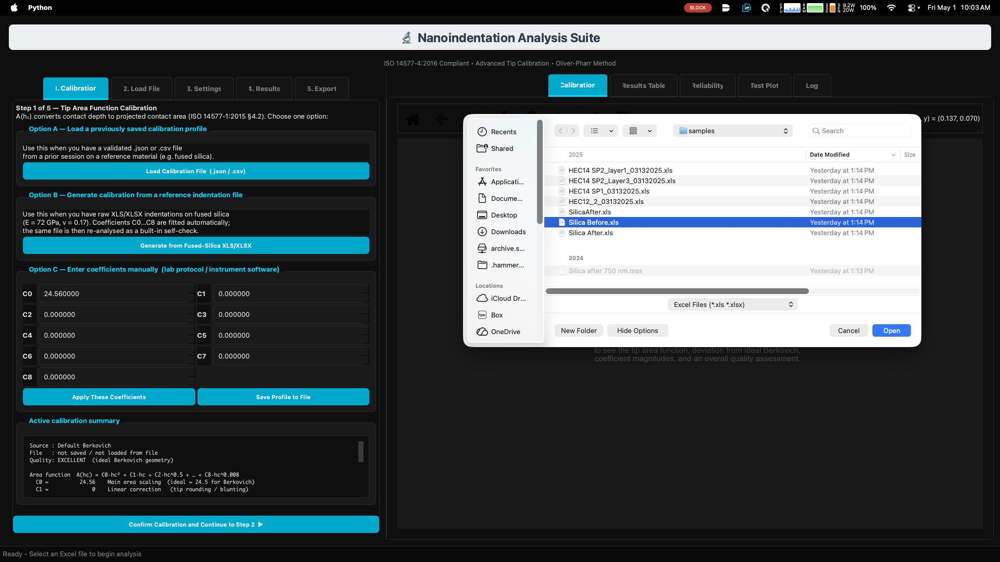

The built-in reference workflow uses fused silica with:

$$
E_s = 72\,\text{GPa}
$$

$$
\nu_s = 0.17
$$

The reduced modulus relation is:

$$
\frac{1}{E_r}=\frac{1-\nu_s^2}{E_s}+\frac{1-\nu_i^2}{E_i}
$$

## Step 3 — Review calibration reliability

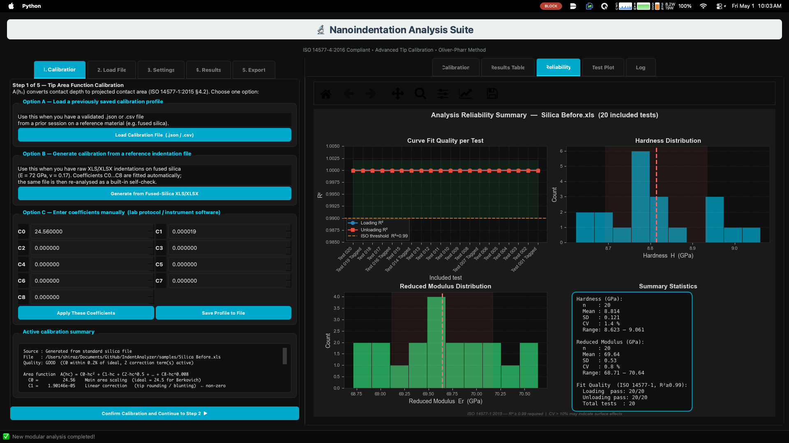

Review fit quality, hardness distribution, reduced modulus distribution, and accepted calibration tests before analyzing unknown samples.

Fit quality is summarized with:

$$
R^2=1-\frac{\sum_i(P_i-\hat{P}_i)^2}{\sum_i(P_i-\bar{P})^2}
$$

## Step 4 — Load the unknown sample file

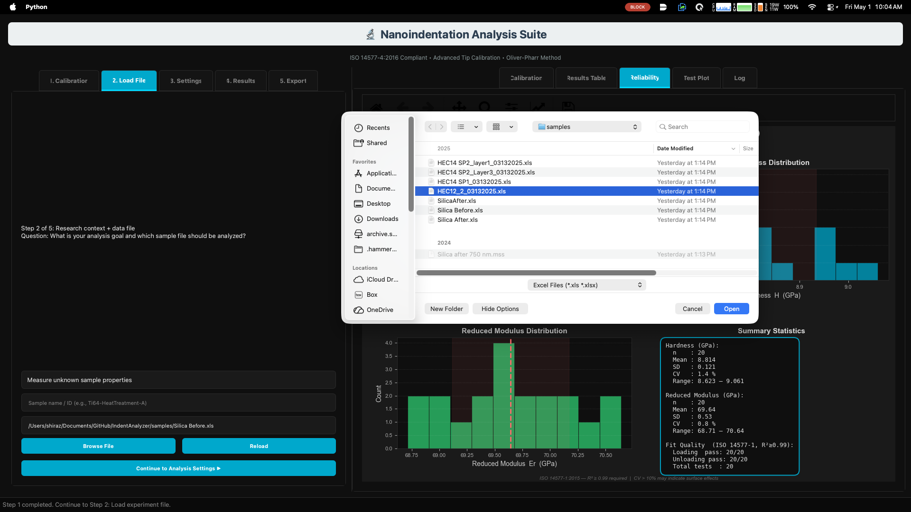

The software identifies the maximum load and associated displacement:

$$
P_{max}=\max(P_i)
$$

$$
h_{max}=h(P_{max})
$$

## Step 5 — Confirm the loaded sample

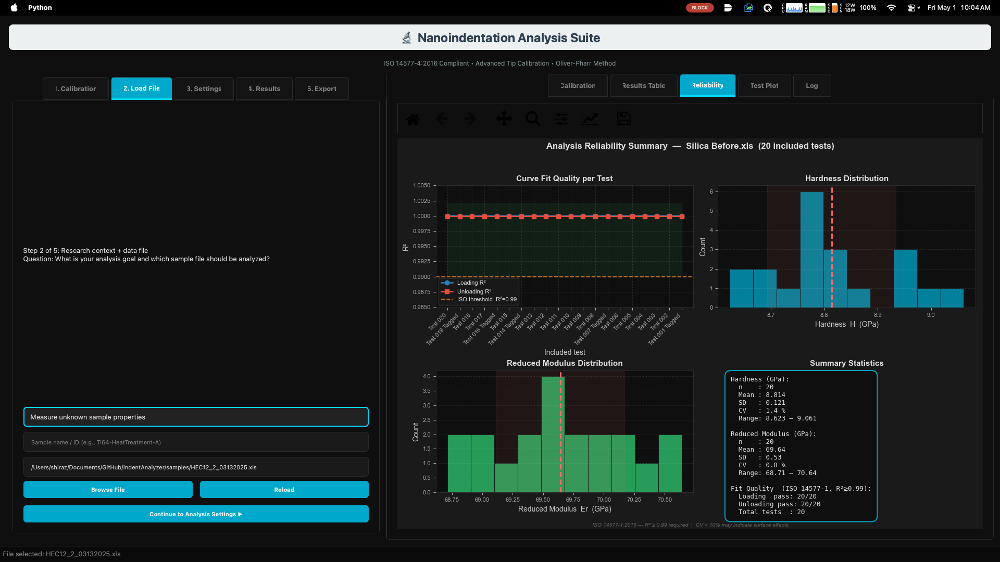

Each indentation test is analyzed independently, and final summary values are calculated only from the currently included tests.

## Step 6 — Choose analysis settings

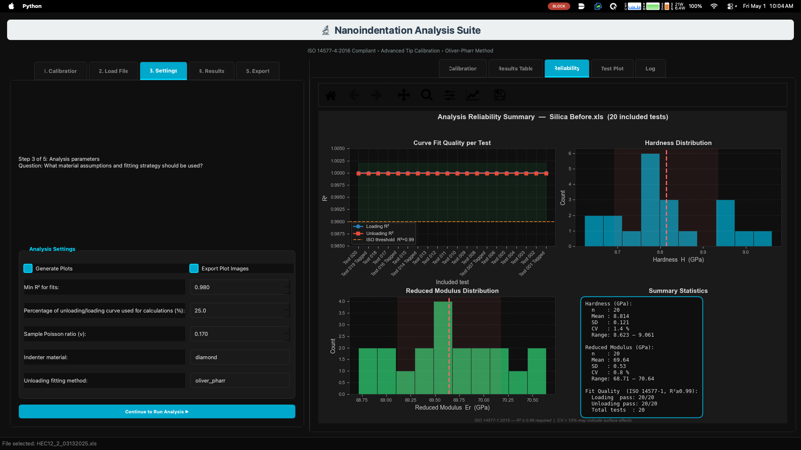

Current GUI settings include:

- plot generation,
- plot export,
- minimum fit quality threshold,
- unloading-curve percentage used for fitting,
- sample Poisson ratio,
- indenter material,
- fitting method.

The unloading curve is fitted using the Oliver–Pharr power law:

$$
P=\alpha(h-h_f)^m
$$

The contact stiffness at maximum depth is:

$$
S=\left.\frac{dP}{dh}\right|_{h=h_{max}}
$$

For the power-law fit:

$$
S=\alpha m(h_{max}-h_f)^{m-1}
$$

## Step 7 — Run the analysis

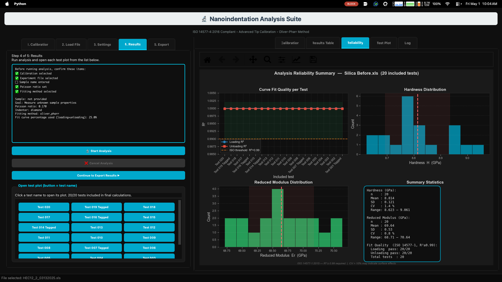

The contact depth is calculated as:

$$
h_c=h_{max}-\varepsilon\frac{P_{max}}{S}
$$

For Berkovich analysis, the current documentation uses the common Oliver–Pharr approximation:

$$
\varepsilon \approx 0.75
$$

## Step 8 — Inspect the results table

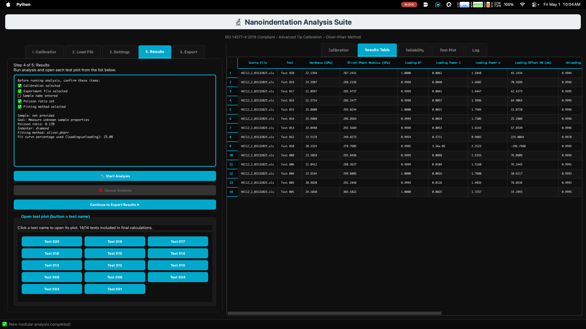

Typical columns include source file, test identifier, hardness, modulus, fit quality, loading-fit parameters, and key mechanical quantities such as stiffness and contact depth.

Hardness is calculated as:

$$
H=\frac{P_{max}}{A_c}
$$

Reduced modulus is calculated as:

$$
E_r=\frac{\sqrt{\pi}}{2}\frac{S}{\sqrt{A_c}}
$$

## Step 9 — Review reliability statistics

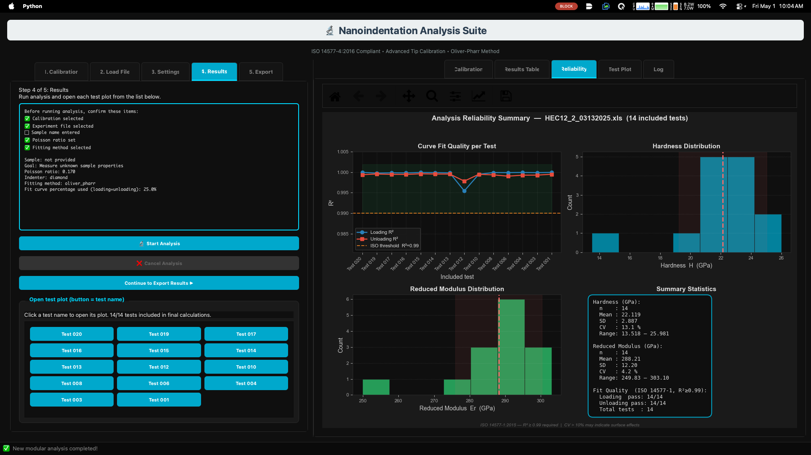

The reliability panel summarizes spread across accepted tests with mean, standard deviation, and coefficient of variation.

$$
\bar{x}=\frac{1}{n}\sum_{i=1}^{n}x_i
$$

$$
s=\sqrt{\frac{1}{n-1}\sum_{i=1}^{n}(x_i-\bar{x})^2}
$$

$$
CV(\%)=\frac{s}{\bar{x}}\times100
$$

## Step 10 — Inspect an individual test curve

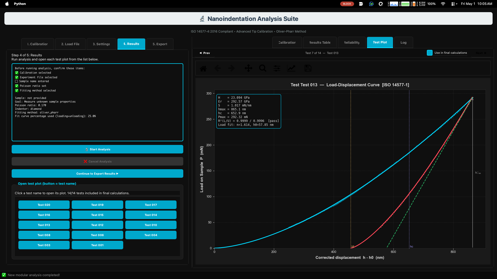

The individual test view separates the curve display from the formatted results summary. Use it to inspect loading data, unloading data, fitted curves, stiffness tangent, residual depth, contact depth, and maximum depth.

The sample modulus is obtained from:

$$
E_s=\frac{1-\nu_s^2}{\frac{1}{E_r}-\frac{1-\nu_i^2}{E_i}}
$$

## Step 11 — Exclude a questionable test

Exclude tests that pass the numerical threshold but are not physically trustworthy, for example because of:

- pores,
- poor contact,
- surface defects,
- abnormal loading behavior,
- large offsets,
- nonrepresentative indentation placement.

After exclusion, final averages are recalculated using the included set only:

$$
\bar{x}_{included}=\frac{1}{n_{included}}\sum_{i=1}^{n_{included}}x_i
$$

## Step 12 — Review the analysis log

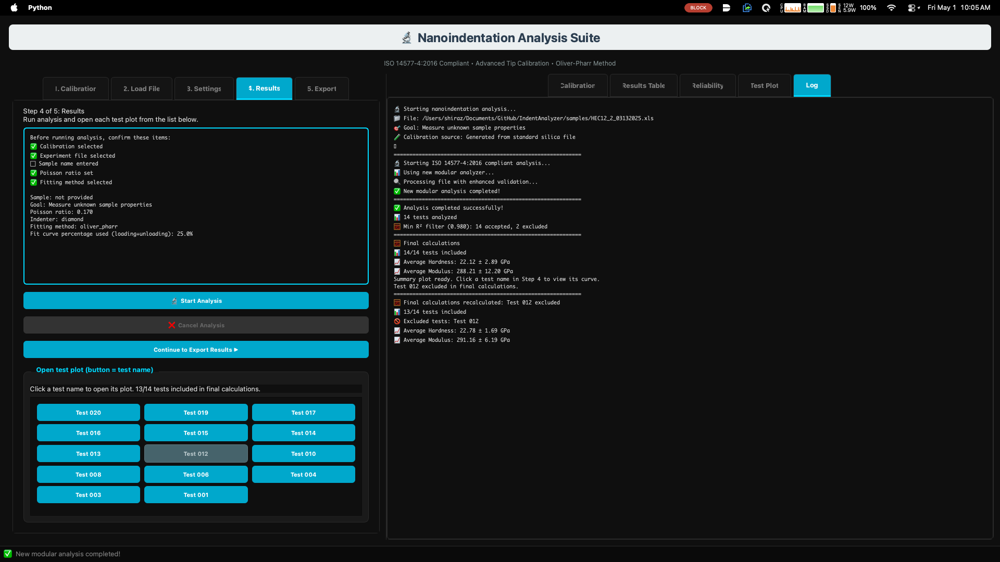

The log records file loading, calibration origin, accepted tests, excluded tests, and recalculated averages. Treat it as the session record that supports reproducibility when final values are exported or reported.
